# Modélisation et générateur de code Hornet lite avec Papyrus

## La génération Hornet avec Papyrus

Le générateur Hornet Papyrus permet de générer du code pour les applications Hornet Lite ou un backend JPA à partir d'un diagramme de classe UML réalisé sous Eclipse Papyrus.

## Création d'un nouveau projet

### Récupération de Papyrus

Si vous n'avez pas déjà installé papyrus, récupéré l'archive sur ftp://forge.ftp.dsinet.diplomatie.gouv.fr/Hornet/hornet-5.1.0/Papyrus/ puis décompresser l'archive.
L'application se lance depuis l'icône papyrus dans le répertoire Papyrus.

#### Récupération des plugins de génération

Ensuite, récupérez les plugins dans le répertoire dist sur github (https://github.com/diplomatiegouvfr/hornet-generator) et collez les dans le dossier `plugins` du Papyrus récupéré.

Si Papyrus est déjà installé, il suffit de récupérer les plugins comme indiqué ci dessus pour les mettre à jour(pensez à supprimer les anciens plugins).

Si les plugins ne sont pas pris en compte avec cette méthode, faites la même chose mais en les copiant dans un dossier `dropins` a la racine du Papyrus.

### Création du projet

Utilisez le template Yeoman `generator-hornet-js-lite` pour générer un nouveau projet Hornet JS Lite.

### Création du modèle

Ouvrir le projet avec Papyrus (ayant les plugins de génération).

Attention: il sera peut être nécessaire d'ajouter un fichier .project pour pouvoir ouvrir le projet sous Eclipse (si le projet a été généré avec Yeoman):

```xml
<?xml version="1.0" encoding="UTF-8"?>
<projectDescription>
	<name>nom-projet</name>
	<comment></comment>
	<projects>
	</projects>
	<buildSpec>
	</buildSpec>
	<natures>
	</natures>
</projectDescription>
```


Click droit sur le projet -> New-> Papyrus Model

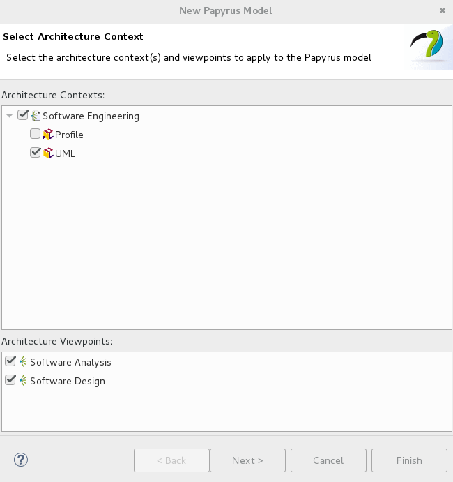

Cliquez sur next.


Choisissez le nom de votre modele puis cliquer sur next.


Choisissez le nom de votre element racine puis cliquez sur Browse Registered Profile.


Choisissez le profile en fonction du type de génération voulut : `Profile Hornet Generateur Lite` pour la génération Hornet Lite `Profile Hornet Generateur JPA` pour la génération JPA.
Cliquez sur OK.


`Attention cette étape n'est pas obligatoire`
Cochez le type `Class Diagram` si vous souhaitez avoir uniquement un seul diagramme de classe, sinon ne cochez pas cette case.

Cliquez sur Finish.

`Si vous avez coché la case Class Diagram passer directement au point 2.4`.

`Si vous n'avez pas coché la case Class Diagram` vous arriverez sur la fenêtre suivante:


Cliquez sur le bouton `Create View` en bas au milieu de la fenêtre.

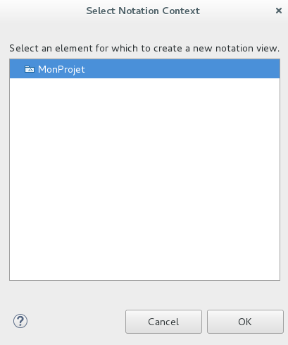

Choissez le profil que vous venez de créer.


Choisissez `Class Diagram` puis appuyer sur OK.


Entrez le nom de votre vue puis cliquer sur OK.

### Ajout des librairies

Ajoutez la librairie Hornet.
Pour cela, sélectionnez votre diagramme dans le Model Explorer, clic droit -> import -> import registered package.


Choisissez le Hornet Type Library


sélectionnez HornetPrimitiveTypes puis cliquez sur OK.


## Exemple de création d'un modèle

Exemple de création d'un modèle d'application simple.
Le tutoriel permettra de générer une application contenant des partenaires, des assistants et des secteurs :


### Création des classes

#### Création de la table secteur

##### création de la table

Pour commencer, créez la classe `Secteur`.
Pour cela, il faut créer une nouvelle classe en glissant/déposant une classe depuis la vue Palette à droite de l'écran.


##### renommer la table

Une fois la classe créée, il est possible de modifier ses propriétés depuis la vue `Properties` qui se trouve en bas de l'écran. Pour ouvrir la vue de la nouvelle classe, cliquer sur celle-ci.

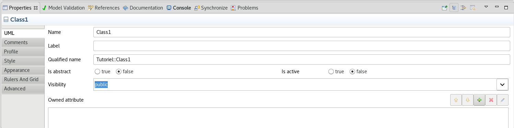

Renommez la classe en `Secteur`.

##### ajout d'un stéréotype

Chaque classe nécessite d'avoir un stéréotype qui permettra d'apporter des informations nécessaires à la génération de celle-ci.

Pour cela, il faut se rendre dans l'onglet `Profile` de la vue `Properties`


Cliquez sur le plus en haut a droite pour ajouter un profil.


Selectionnez le profil `entity` en double cliquant sur le nom ou en cliquant dessus puis en cliquant sur la flèche vers la droite.
Une fois le profil choisi cliquer sur OK.

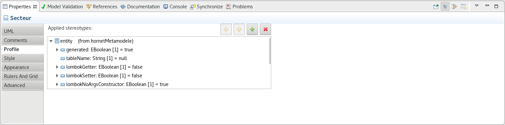

Les attributs du profil sont disponibles.
Pour changer la valeur d'un attribut du stéréotype, cliquez dessus.

##### ajout d'attributs

Ajoutez des attributs à la classe `Secteur`.

Pour cela, il faut cliquer sur la classe. Un menu contextuel va s'ouvrir. Cliquez sur l'icone indiqué pour ajouter un attribut:

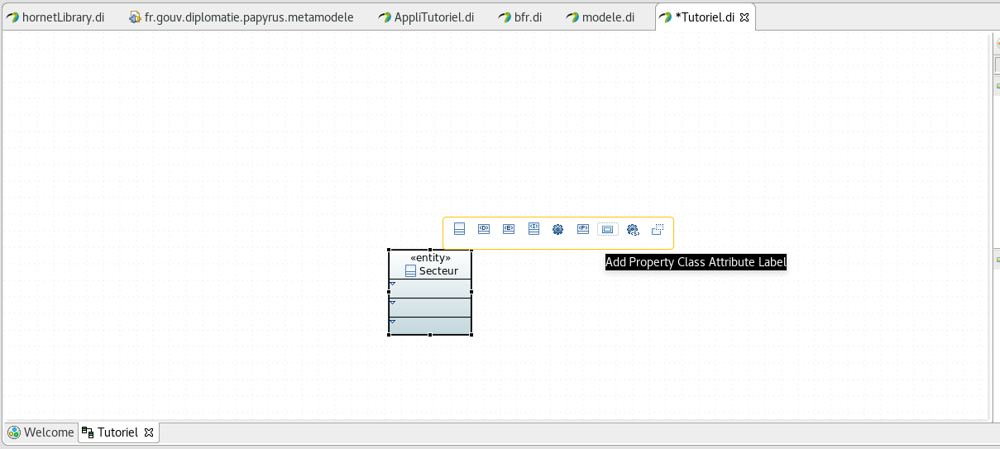

Une fois l'attribut créé, cliquez dessus pour voir ses propriétés:


renommez l'attribut en `id`, il s'agira de l'identifiant de la classe.

Pour changer le type de l'attribut, cliquez sur le bouton `...` situé à droite de la propriété `Type`


Sélectionnez Integer parmis les types `HornetPrimitiveTypes`.

Pour les attributs, il est possible de choisir un type parmis les `HornetPrimitiveTypes` ou les types créés dans votre modèle.

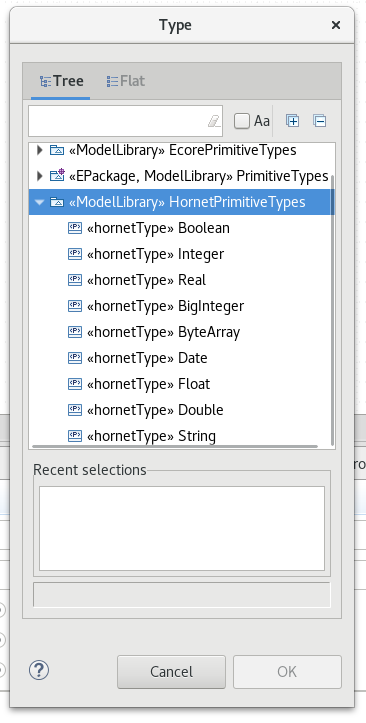

Une fois le type choisit, ajouter un stéréotype `keyAttribute` à votre attribut.
Ce stéréotype permet de définir que cet attribut sera l'identifiant de la classe `Secteur`.

Une classe possédant un stéréotype `entity` doit obligatoiremment avoir un identifiant pour la génération.

Ensuite, créer de la même façon un autre attribut `nom` qui aura pour type `String` et comme stéréotype `attribute`.
Tout attribut n'étant pas un identifiant devra posséder le stéréotype `attribut` pour la génération de code.

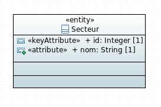

## Ajouter un commentaire

Les commentaires seront présents dans les classe métiers générées.


Pour ajouter un commentaire, allez dans l'onglet `comments` de la vue `Properties`.
Cliquez sur le plus en haut a droite du champs `Applied comments`.


Ecrivez votre commentaire puis cliquer sur OK.

#### Création des tables partenaire et assistant

De la même façon que pour la table `Secteur`, créez une table `Partenaire` avec les champs suivants:


Il est possible de créer des classes ayant le stéréotype `valueObject`.
Ces classes représentent des ensembles de champs qui seront ajoutés à la classe les possédant. Ces classes n'ont pas d'existance propre. Elles ne seront présentent que dans les entités les possédant.

Pour cela, créez une nouvelle classe `Assistant`:


Puis, dans la classe Partenaire, ajouter des champs de type `Assistant`
Un champs `assistantPrincipal` et un champs `assistantSecondaire`.


##### Indiquer qu'un champ est nullable

Pour indiquer que la valeur d'un champs peut être mise à `null`, il faut changer sa multiplicité dans l'onglet `Properties` et la mettre à 0..1 (pour un champ null ou de multiplicité 1):

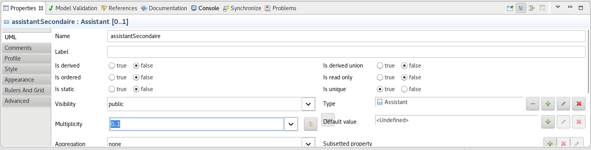

#### Création d'un association entre deux tables

Créez un lien entre la table `Secteur` et la table `Partenaire`.
Pour cela, allez dans la vue `Palette` et sélectionnez `Association (directed)`


Ensuite, créez le lien de la table `Partenaire` vers la table `Secteur`

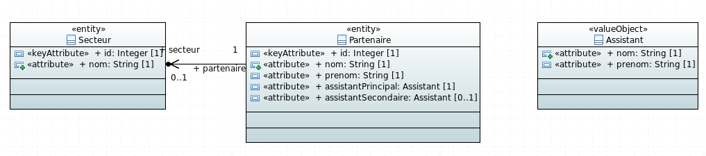

Il est possible de changer le nom des variables de l'association en cliquant sur celle-ci et en modifiant les données dans la vue `Properties`


### Validation du modèle

A tout moment, il est possible d'appeler une validation du modèle.


Pour cela, faites un clic droit sur le model dans la vue `Model Explorer` -> `Hornet Generation` et sélectionnez `Valider le modèle`.

Pour la génération en JPA il faudra sélectionner `valider le modèle(Java)`.

Dans la vue `Console` vous pourrez voir si des erreurs ont été faites dans le modèle, sinon le modèle sera validé. (cf point 8 (logs de génération) pour l'ouverture de la console)


### Lancement de la génération


Une fois votre diagramme de classe terminé, faites un clic droit sur le model dans la vue `Model Explorer `-> `Hornet Generation`.

Six options sont disponibles:

- (ctrl+1) Valider le modèle: indique si le modèle est valide. S'il ne l'est pas, affiche les erreurs.
- (ctrl+2) Generate All Hornet Code: génère tous les fichiers pour Hornet Lite(cf liste ci dessous)
- (ctrl+4) Generate Database Script: génère uniquement le script de création de la base de données
- (ctrl+5) Generate Class: Metier: génère les classes metiers
- (ctrl+6) Valider le modèle (Java): comme `valider le modèle` mais avec une validation des stéréotypes liés à la génération JPA.
- (ctrl+7) Generate JPA Entities: génère les entités JPA


Le code sera généré dans un dossier src-gen dans votre projet.

La commande `Generate All Hornet Code` permet de générer les fichiers suivants:

- le script de création et le script d'update de la base de donnée (src-gen/database)
- le modelDAO qui décrit les relations entre les entités de la base (src-gen/dao)
- les modeles des classes (src-gen/models/models)
- les interfaces d'attributs des classe (src-gen/models/attributs)
- les DTO des classes (src-gen/models/dto)
- les classes metier des classes (src-gen/models/metier)

Au lancement de certaines générations, il vous sera proposé de généré les imports en utilisant `src` ou `src-gen`

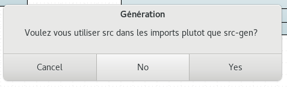

Si vous souhaitez utiliser les fichiers générés directement depuis le dossier généré `src-gen` choisissez `No`. Sinon, choisissez `Yes`.

`Cancel` annulera le lancement de la génération.

## Changer de profil

Il est possible de passer d'un profil à un autre. Seuls les attributs spécifique au profil seront perdus lors du changement de profil.
Les attributs communs ne seront pas modifiés.

Pour changer de profil, faites un clic droit sur le model dans la vue `Model Explorer `.
Dans le menu `Model refactor` choisissez `Switch profiles..`.


cliquez sur le bouton à droite du bouton `+`, puis sélectionnez le profil souhaité. Cliquez sur `Apply`. Un message d'information peut s'afficher, cliquer sur `Ok`, le message se ferme. Ensuite, cliquez sur `Ok`.

## Les features UML prises en compte dans le générateur

### Les interfaces


### Les généralisations

`Attention`: pour les généralisations, les deux classes ne doivent pas avoir d'attributs ayant le même nom.


### Les associations

Les tables peuvent être associées a d'autres tables.

Dans le cas suivants, un attributs nommé `autreclasse` sera présent dans `maClasse` il est possible de renommer ce champs.

Toutes les multiplicités sont disponibles.


### Les tables d'associations

Il est possible de créer des tables d'association entre deux classes ou plus.

Il faut au moins une entité reliée a la table d'association.


Pour créer une table d'association a plus de deux membres, il faudra tout d'abord en créer une entre deux classes, puis, ajouter une branche d'association entre les autres classes et l'association précedemment créée.

## Les attributs

### Les attributs primitifs

Les types primitifs proposés par le générateur sont les suivants:

- Boolean
- Integer
- BigInteger
- Real
- Double
- Float
- Date
- String
- ByteArray

Il est possible de créer son propre type primitif en lui ajoutant le stéréotype `hornetType` et en complétant les informations liées à ce stéréotype.

Toutes les multiplicités sont disponibles.

### Les attributs non primitifs

Il est possible d'avoir un attribut dont le type est une autres classe du modèle ( stéréotype entity, valueObject ou nomenclature).

Toutes les multiplicités sont disponibles.

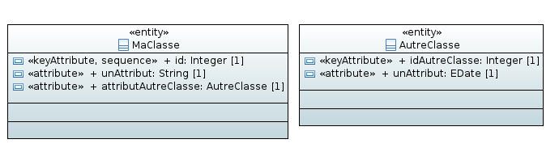

## Logs de génération

Pour voir les logs de génération, il faudra ouvrir la vue console.

Si celle-ci n'est pas déja ouverte, allez dans `Window` -> `Show view` -> `Other...` -> `Console`

