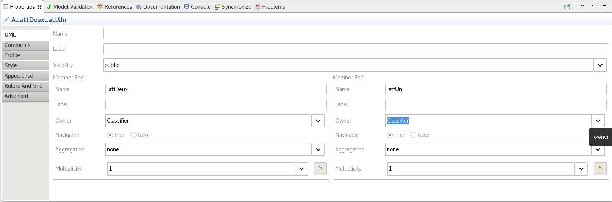
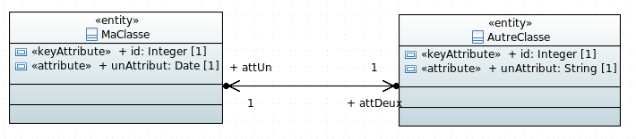
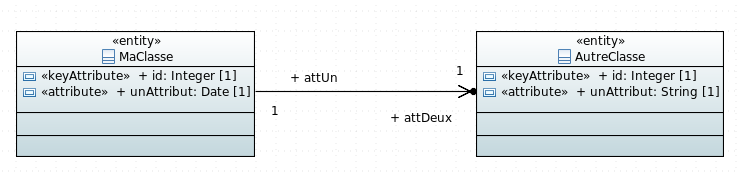
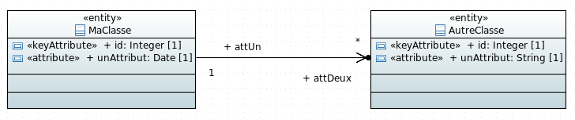
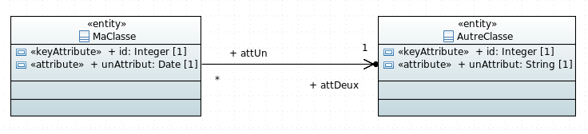
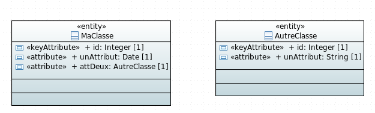
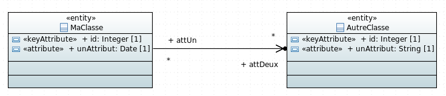
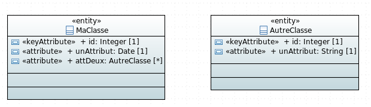

# Exemple de génération d'association

##

Les associations directionelles peuvent être dans un sens ou dans les deux sens.
Lorsqu'elles sont orientées dans un sens, seuls les champs de la classe de laquelle part l'association seront générés (`attention: sauf pour les associations many to many où tous les champs seront générés même si l'association n'est que dans un sens. Ne pas utiliser l'association dans les deux sens pour ce cas la.`)

Pour passer une association dans les deux sens il faut cliquer sur le lien d'association, allez dans le vue `Properties` et changer la propriété `Owner` du `Member End` pour la passer de `Association` a `Classifier`:



L'association sera alors dans les deux sens:



## One To One



### Script de création de la base

Dans le script de création de la base de données la relation sera générées de la façon suivante:

Le nom de l'attribut présent dans la table de `MaClasse` est composé a partir du nom de l'identifiant de la table `AutreClasse` et du nom de la propriété présent sur la branche.

createTableSequelize.sql:

```sql
CREATE TABLE ma_classe(
	id integer NOT NULL,
	un_attribut timestamp NOT NULL,
	id_att_deux integer NOT NULL
);

ALTER TABLE ONLY ma_classe
    ADD CONSTRAINT ma_classe_att_deux_ids_fkey
    FOREIGN KEY (id_att_deux) REFERENCES autre_classe(id);
```

si l'association est dans les deux sens on aura également:

```sql
CREATE TABLE autre_classe(
	id integer NOT NULL,
	un_attribut text NOT NULL,
	id_att_un integer NOT NULL
);

ALTER TABLE ONLY autre_classe
    ADD CONSTRAINT autre_classe_att_un_ids_fkey
    FOREIGN KEY (id_att_un) REFERENCES ma_classe(id);
```

### Sequelize Models

ma-classe-model.ts:

```javascript
import Sequelize = require("sequelize");

export const MaClasseModel: Sequelize.DefineAttributes = {
    id: {
        type: Sequelize.INTEGER,
        field: "id",
        allowNull: false,
        primaryKey: true,
    },
    unAttribut: {
        type: Sequelize.DATE,
        field: "un_attribut",
        allowNull: false,
    },
    idAttDeux: {
        type: Sequelize.INTEGER,
        field: "id_att_deux",
        allowNull: false,
        references: {
            model: "AutreClasseModel",
            key: "id",
        },
    },
};
```

### Model DAO

Dans le model DAO la rélation est générée de la façon suivante:

model-dao.ts:

```javascript
    private initMaClasseEntity(): void {
        SequelizeUtils.initRelationBelongsTo({
            fromEntity: this.maClasseEntity,
            toEntity: this.autreClasseEntity,
            alias: "attDeux",
            foreignKey: "id_att_deux"});
    }

    // code si dessous généré uniquement
    // si l'association est dans les deux sens
    private initAutreClasseEntity(): void {
        SequelizeUtils.initRelationBelongsTo({
            fromEntity: this.autreClasseEntity,
            toEntity: this.maClasseEntity,
            alias: "attUn",
            foreignKey: "id_att_un"});
    }
```

### Interface attributes

ma-classe-attributes.ts:

```javascript
import { AutreClasseAttributes } from "src/models/attributes/autre-classe-attributes";

export interface MaClasseAttributes {
    
    id?: number;
    unAttribut?: string;
    idAttDeux?: number;

    attDeux: AutreClasseAttributes;
    getAttDeux(): Promise<AutreClasseAttributes>;
    
}
```

si l'association est dans les deux sens dans l'autre classe on aura:

autre-classe-attributes.ts:

```javascript
import { MaClasseAttributes } from "src/models/attributes/ma-classe-attributes";

export interface AutreClasseAttributes {
    
    id?: number;
    unAttribut?: string;
    idAttUn?: number;

    attUn: MaClasseAttributes;
    getAttUn(): Promise<MaClasseAttributes>;
    
}
```

### DTO

Dans le DTO il sera possible de passer soit l'id de la classe `AutreClasse` soit directement un objet `AutreClasseDTO`.

ma-classe-dto.ts:

```javascript
import Alias from "hornet-js-bean/src/decorators/Alias";
import Bean from "hornet-js-bean/src/decorators/Bean";
import Map from "hornet-js-bean/src/decorators/Map";

import { AutreClasseDTO } from "src/models/dto/autre-classe-dto";

@Bean
export class MaClasseDTO {
    
    @Map()
    id: number;
    
    @Map()
    unAttribut: Date;
    
    @Map()
    @Alias("idAttDeux", "attDeux.id")
    idAttDeux: number;
    
    @Map(AutreClasseDTO)
    attDeux: AutreClasseDTO;
}
```

si l'association est dans les deux sens dans l'autre classe on aura:

autre-classe-dto.ts:

```javascript
import Alias from "hornet-js-bean/src/decorators/Alias";
import Bean from "hornet-js-bean/src/decorators/Bean";
import Map from "hornet-js-bean/src/decorators/Map";

import { MaClasseDTO } from "src/models/dto/ma-classe-dto";

@Bean
export class AutreClasseDTO {
    
    @Map()
    id: number;
    
    @Map()
    unAttribut: string;
    
    @Map()
    @Alias("idAttUn", "attUn.id")
    idAttUn: number;
    
    @Map(MaClasseDTO)
    attUn: MaClasseDTO;
}
```

### Classes métier

ma-classe-metier.ts: 

```javascript
import Bean from "hornet-js-bean/src/decorators/Bean";
import Map from "hornet-js-bean/src/decorators/Map";

import { AutreClasseMetier } from "src/models/metier/autre-classe-metier";

@Bean
export class MaClasseMetier {
    
    @Map()
    id: number;
    
    @Map()
    unAttribut: Date;
    
    @Map(AutreClasseMetier)
    attDeux: AutreClasseMetier;
    
}
```

si l'association est dans les deux sens dans l'autre classe on aura:

autre-classe-metier.ts:

```javascript
import Bean from "hornet-js-bean/src/decorators/Bean";
import Map from "hornet-js-bean/src/decorators/Map";

import { MaClasseMetier } from "src/models/metier/ma-classe-metier";

@Bean
export class AutreClasseMetier {
    
    @Map()
    id: number;
    
    @Map()
    unAttribut: string;
    
    @Map(MaClasseMetier)
    attUn: MaClasseMetier;
    
}
```

## One To Many



### Script de création de la base

Dans le script de création de la base de données la relation sera générées de la façon suivante:

Un attribut est généré dans la table `AutreClasse`. Son nom est composé du nom de l'i de la classe `MaClasse` et du nom de la propriété present sur le lien entre les deux classes.

createTablesPostgres.sql:

```sql
CREATE TABLE autre_classe(
	id integer NOT NULL,
	un_attribut text NOT NULL,
	id_att_un integer NOT NULL
);

ALTER TABLE ONLY autre_classe
    ADD CONSTRAINT autre_classe_att_un_ids_fkey
    FOREIGN KEY (id_att_un) REFERENCES ma_classe(id);
```
### Sequelize Models

autre-classe-model.ts:

```javascript
import Sequelize = require("sequelize");

export const AutreClasseModel: Sequelize.DefineAttributes = {
    id: {
        type: Sequelize.INTEGER,
        field: "id",
        allowNull: false,
        primaryKey: true,
    },
    unAttribut: {
        type: Sequelize.STRING,
        field: "un_attribut",
        allowNull: false,
    },
    idAttUn: {
        type: Sequelize.INTEGER,
        field: "id_att_un",
        references: {
            model: "MaClasseModel",
            key: "id",
        },
    },
};
```

### Model DAO

model-dao.ts:

```javascript
    private initMaClasseEntity(): void {
        SequelizeUtils.initRelationHasMany({
            fromEntity: this.maClasseEntity,
            toEntity: this.autreClasseEntity,
            alias: "attDeux", foreignKey: "id_att_un"});
    }
    
    // code si dessous généré uniquement
    // si l'association est dans les deux sens
    private initAutreClasseEntity(): void {
        SequelizeUtils.initRelationBelongsTo({
            fromEntity: this.autreClasseEntity,
            toEntity: this.maClasseEntity,
            alias: "attUn",
            foreignKey: "id_att_un"});
    }
```

### Interface attributes

ma-classe-attributes.ts:

```javascript
import { AutreClasseAttributes } from "src/models/attributes/autre-classe-attributes";

export interface MaClasseAttributes {
    
    id?: number;
    unAttribut?: string;

    attDeux: Array<AutreClasseAttributes>;
    getAttDeux(): Promise<Array<AutreClasseAttributes>>;
    
}
```

si l'association est dans les deux sens dans l'autre classe on aura:

autre-classe-attributes.ts:

```javascript
import { MaClasseAttributes } from "src/models/attributes/ma-classe-attributes";

export interface AutreClasseAttributes {
    
    id?: number;
    unAttribut?: string;

    idAttUn?: number;
    attUn?: MaClasseAttributes;
    getAttUn(): Promise<MaClasseAttributes>;
}
```

### DTO

ma-classe-dto.ts:

```javascript
import Alias from "hornet-js-bean/src/decorators/Alias";
import Bean from "hornet-js-bean/src/decorators/Bean";
import Map from "hornet-js-bean/src/decorators/Map";

import { AutreClasseDTO } from "src/models/dto/autre-classe-dto";

@Bean
export class MaClasseDTO {
    
    @Map()
    id: number;
    
    @Map()
    unAttribut: Date;
    
    @Map(AutreClasseDTO)
    attDeux: Array<AutreClasseDTO>;
}
```

si l'association est dans les deux sens dans l'autre classe on aura:

autre-classe-dto.ts:

```javascript
import Alias from "hornet-js-bean/src/decorators/Alias";
import Bean from "hornet-js-bean/src/decorators/Bean";
import Map from "hornet-js-bean/src/decorators/Map";

import { MaClasseDTO } from "src/models/dto/ma-classe-dto";

@Bean
export class AutreClasseDTO {
    
    @Map()
    id: number;
    
    @Map()
    unAttribut: string;
    
    @Map()
    @Alias("idAttUn", "attUn.id")
    idAttUn: number;
    
    @Map(MaClasseDTO)
    attUn: MaClasseDTO;
}
```

### Classes métier

ma-classe-metier.ts:

```javascript
import Bean from "hornet-js-bean/src/decorators/Bean";
import Map from "hornet-js-bean/src/decorators/Map";

import { AutreClasseMetier } from "src/models/metier/autre-classe-metier";

@Bean
export class MaClasseMetier {
    
    @Map()
    id: number;
    
    @Map()
    unAttribut: Date;
    
    @Map(AutreClasseMetier)
    attDeux: Array<AutreClasseMetier>;
    
}
```

si l'association est dans les deux sens dans l'autre classe on aura:

autre-classe-metier.ts:

```javascript
import Bean from "hornet-js-bean/src/decorators/Bean";
import Map from "hornet-js-bean/src/decorators/Map";

import { MaClasseMetier } from "src/models/metier/ma-classe-metier";

@Bean
export class AutreClasseMetier {
    
    @Map()
    id: number;
    
    @Map()
    unAttribut: string;
    
    @Map(MaClasseMetier)
    attUn: MaClasseMetier;
    
}
```

## Many To One



Ou



### Script de création de la base

Dans le script de création de la base de données la relation est générée de la façon suivante:

createTablePostgres.sql:

```sql
CREATE TABLE ma_classe(
	id integer NOT NULL,
	un_attribut timestamp NOT NULL,
	id_att_deux integer NOT NULL
);
ALTER TABLE ONLY ma_classe
    ADD CONSTRAINT ma_classe_att_deux_ids_fkey
    FOREIGN KEY (id_att_deux) REFERENCES autre_classe(id);
```

### Sequelize Models

ma-classe-model.ts:

```javascript
import Sequelize = require("sequelize");

export const MaClasseModel: Sequelize.DefineAttributes = {
    id: {
        type: Sequelize.INTEGER,
        field: "id",
        allowNull: false,
        primaryKey: true,
    },
    unAttribut: {
        type: Sequelize.DATE,
        field: "un_attribut",
        allowNull: false,
    },
    idAttDeux: {
        type: Sequelize.INTEGER,
        field: "id_att_deux",
        allowNull: false,
        references: {
            model: "AutreClasseModel",
            key: "id",
        },
    },
};
```

### Model DAO

Dans le model DAO la relation est générée de la façon suivante:

model-dao.ts:

```javascript
    private initMaClasseEntity(): void {
        SequelizeUtils.initRelationBelongsTo({
            fromEntity: this.maClasseEntity,
            toEntity: this.autreClasseEntity,
            alias: "attDeux",
            foreignKey: "id_att_deux"});
    }

    // code si dessous généré uniquement
    // si l'association est dans les deux sens
    private initAutreClasseEntity(): void {
        SequelizeUtils.initRelationHasMany({
            fromEntity: this.autreClasseEntity,
            toEntity: this.maClasseEntity,
            alias: "attUn", foreignKey: "id_att_deux"});
    }
```

### Interface attributes

ma-classe-attributes.ts:

```javascript
import { AutreClasseAttributes } from "src/models/attributes/autre-classe-attributes";

export interface MaClasseAttributes {
    
    id?: number;
    unAttribut?: string;
    idAttDeux?: number;

    attDeux: AutreClasseAttributes;
    getAttDeux(): Promise<AutreClasseAttributes>;
    
}
```

si l'association est dans les deux sens dans l'autre classe on aura:

autre-classe-attributes.ts:

```javascript
import { MaClasseAttributes } from "src/models/attributes/ma-classe-attributes";

export interface AutreClasseAttributes {
    
    id?: number;
    unAttribut?: string;

    attUn: Array<MaClasseAttributes>;
    getAttUn(): Promise<Array<MaClasseAttributes>>;
    
}
```

### DTO

ma-classe-dto.ts:

```javascript
import Alias from "hornet-js-bean/src/decorators/Alias";
import Bean from "hornet-js-bean/src/decorators/Bean";
import Map from "hornet-js-bean/src/decorators/Map";

import { AutreClasseDTO } from "src/models/dto/autre-classe-dto";

@Bean
export class MaClasseDTO {
    
    @Map()
    id: number;
    
    @Map()
    unAttribut: Date;
    
    @Map()
    @Alias("idAttDeux", "attDeux.id")
    idAttDeux: number;
    
    @Map(AutreClasseDTO)
    attDeux: AutreClasseDTO;
}
```


si l'association est dans les deux sens dans l'autre classe on aura:

autre-classe-dto.ts:

```javascript
import Alias from "hornet-js-bean/src/decorators/Alias";
import Bean from "hornet-js-bean/src/decorators/Bean";
import Map from "hornet-js-bean/src/decorators/Map";

import { MaClasseDTO } from "src/models/dto/ma-classe-dto";

@Bean
export class AutreClasseDTO {
    
    @Map()
    id: number;
    
    @Map()
    unAttribut: string;
    
    @Map(MaClasseDTO)
    attUn: Array<MaClasseDTO>;
}
```

### Classes métier

ma-classe-metier.ts:

```javascript
import Bean from "hornet-js-bean/src/decorators/Bean";
import Map from "hornet-js-bean/src/decorators/Map";

import { AutreClasseMetier } from "src/models/metier/autre-classe-metier";

@Bean
export class MaClasseMetier {
    
    @Map()
    id: number;
    
    @Map()
    unAttribut: Date;
    
    @Map(AutreClasseMetier)
    attDeux: AutreClasseMetier;
    
}
```

si l'association est dans les deux sens dans l'autre classe on aura:

autre-classe-metier.ts:

```javascript
import Bean from "hornet-js-bean/src/decorators/Bean";
import Map from "hornet-js-bean/src/decorators/Map";

import { MaClasseMetier } from "src/models/metier/ma-classe-metier";

@Bean
export class AutreClasseMetier {
    
    @Map()
    id: number;
    
    @Map()
    unAttribut: string;
    
    @Map(MaClasseMetier)
    attUn: Array<MaClasseMetier>;
    
}
```

## Many To Many

### Many to Many avec association



#### Script de création de la base

Dans le script de création de la base de données la relation sera générée de la façon suivante:

createTablePostgres.sql:

```sql
CREATE TABLE ma_classe_att_deux(
	id_att_deux integer NOT NULL,
	id_ma_classe integer NOT NULL
);

ALTER TABLE ONLY ma_classe_att_deux
    ADD CONSTRAINT ma_classe_att_deux_ma_classe_ids_fkey
    FOREIGN KEY (id_ma_classe) REFERENCES ma_classe(id);
    
ALTER TABLE ONLY ma_classe_att_deux
    ADD CONSTRAINT ma_classe_att_deux_autre_classe_ids_fkey
    FOREIGN KEY (id_att_deux) REFERENCES autre_classe(id);
    
ALTER TABLE ONLY ma_classe_att_deux
    ADD CONSTRAINT ma_classe_att_deux_pkey PRIMARY KEY(id_ma_classe, id_att_deux);
```

#### Sequelize Models

Dans le model de `MaClasse` la relaton sera générée de la façon suivante:

ma-classe-model.ts:

```javascript
export const MaClasseAttDeuxModel: Sequelize.DefineAttributes={
    idAutreClasse:{
        type: Sequelize.INTEGER,
        field: "id_att_deux",
        allowNull: false,
        primaryKey: true,
        references: {
            model: "AutreClasseModel",
            key: "id",
        },
    },
    idMaClasse:{
        type: Sequelize.INTEGER,
        field: "id_ma_classe",
        allowNull: false,
        primaryKey: true,
        references: {
            model: "MaClasseModel",
            key: "id",
        },
    },
};
```

#### Model DAO

Dans le model DAO la relaton sera générée de la façon suivante:

model-dao.ts:

```javascript
    private initMaClasseEntity(): void {
        SequelizeUtils.initRelationBelongsToMany({
            fromEntity: this.maClasseEntity,
            toEntity: this.autreClasseEntity,
            alias: "attDeux",
            foreignKey: "id_ma_classe",
            throughTable: this.maClasseAttDeuxEntity});
    }
    
    private initAutreClasseEntity(): void {
    }
    
    public initMaClasseAttDeuxEntity(): void {
        SequelizeUtils.initRelationBelongsTo({
            fromEntity: this.maClasseAttDeuxEntity,
            toEntity: this.maClasseEntity,
            alias: "maClasse",
            foreignKey: "id_ma_classe"});
        SequelizeUtils.initRelationBelongsTo({
            fromEntity: this.maClasseAttDeuxEntity,
            toEntity: this.autreClasseEntity,
            alias: "attDeux",
            foreignKey: "id_att_deux"});
    }
```

#### Interface attributes

ma-classe-attributes.ts:

```javascript
import { AutreClasseAttributes } from "src/models/attributes/autre-classe-attributes";

export interface MaClasseAttributes {
    
    id?: number;
    unAttribut?: string;

    attDeux: Array<AutreClasseAttributes>;
    getAttDeux(): Promise<Array<AutreClasseAttributes>>;
    
}
```

autre-classe-attributes.ts:

```javascript
import { MaClasseAttributes } from "src/models/attributes/ma-classe-attributes";

export interface AutreClasseAttributes {
    
    id?: number;
    unAttribut?: string;

    attUn: Array<MaClasseAttributes>;
    getAttUn(): Promise<Array<MaClasseAttributes>>;
}
```

#### DTO

ma-classe-dto.ts:

```javascript
import Alias from "hornet-js-bean/src/decorators/Alias";
import Bean from "hornet-js-bean/src/decorators/Bean";
import Map from "hornet-js-bean/src/decorators/Map";

import { AutreClasseDTO } from "src/models/dto/autre-classe-dto";

@Bean
export class MaClasseDTO {
    
    @Map()
    id: number;
    
    @Map()
    unAttribut: Date;
    
    @Map(AutreClasseDTO)
    attDeux: Array<AutreClasseDTO>;
}


export class MaClasseAttDeuxDTO{
	
	@Map()
	idMaClasse: number;
	
	@Map(MaClasseDTO)
	maClasse: MaClasseDTO;
	
	@Map()
	idAutreClasse: number;
	
	@Map(AutreClasseDTO)
	autreClasse: AutreClasseDTO;
}
```

autre-classe-dto.ts:

```javascript
import Alias from "hornet-js-bean/src/decorators/Alias";
import Bean from "hornet-js-bean/src/decorators/Bean";
import Map from "hornet-js-bean/src/decorators/Map";

import { MaClasseDTO } from "src/models/dto/ma-classe-dto";

@Bean
export class AutreClasseDTO {
    
    @Map()
    id: number;
    
    @Map()
    unAttribut: string;
    
    @Map(MaClasseDTO)
    attUn: Array<MaClasseDTO>;
}
```

#### Classes métier

ma-classe-metier.ts:

```javascript
import Bean from "hornet-js-bean/src/decorators/Bean";
import Map from "hornet-js-bean/src/decorators/Map";

import { AutreClasseMetier } from "src/models/metier/autre-classe-metier";

@Bean
export class MaClasseMetier {
    
    @Map()
    id: number;
    
    @Map()
    unAttribut: Date;
    
    @Map(AutreClasseMetier)
    attDeux: Array<AutreClasseMetier>;
    
}
```

autre-classe-metier.ts:

```javascript
import Bean from "hornet-js-bean/src/decorators/Bean";
import Map from "hornet-js-bean/src/decorators/Map";

import { MaClasseMetier } from "src/models/metier/ma-classe-metier";

@Bean
export class AutreClasseMetier {
    
    @Map()
    id: number;
    
    @Map()
    unAttribut: string;
    
    @Map(MaClasseMetier)
    attUn: Array<MaClasseMetier>;
    
}
```

### Many to Many sans association



La génération sans lien a quelque différences:

#### Model DAO

model-dao.ts:

```javascript
    private initAutreClasseEntity(): void {
        SequelizeUtils.initRelationBelongsToMany({
            fromEntity: this.autreClasseEntity,
            toEntity: this.maClasseEntity,
            alias: "attDeux",
            foreignKey: "id_autre_classe",
            throughTable: this.autreClasseAttDeuxEntity});
    }
```

#### Interface attributes

autre-classe-attributes.ts:

```javascript
export interface AutreClasseAttributes {
    
    id?: number;
    unAttribut?: string;

}
```

#### DTO

autre-classe-dto.ts:

```javascript
import Alias from "hornet-js-bean/src/decorators/Alias";
import Bean from "hornet-js-bean/src/decorators/Bean";
import Map from "hornet-js-bean/src/decorators/Map";


@Bean
export class AutreClasseDTO {
    
    @Map()
    id: number;
    
    @Map()
    unAttribut: string;
}
```

#### Classes métier

autre-classe-metier.ts:

```javascript
import Bean from "hornet-js-bean/src/decorators/Bean";
import Map from "hornet-js-bean/src/decorators/Map";


@Bean
export class AutreClasseMetier {
    
    @Map()
    id: number;
    
    @Map()
    unAttribut: string;
    
}
```