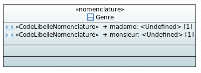

# Exemple de génération de nomenclature



Il est possible de définir un code pour chaque attribut `CodeLibelleNomenclature`. Si le code n'est pas définit ou si deux codes sont identiques un code par défaut est généré. Le code par défaut est la suite des entier naturel en partant de zéro.

## Script de création de la base

createTablesPostgres.sql:

```sql
CREATE TABLE genre(
	code integer NOT NULL,
	libelle text
);

ALTER TABLE ONLY genre
	ADD CONSTRAINT genre_pkey PRIMARY KEY (code);

INSERT INTO genre (code, libelle) VALUES (0, 'madame');
INSERT INTO genre (code, libelle) VALUES (1, 'monsieur');
```

## Sequelize Models

genre-model.ts:

```javascript
import Sequelize = require("sequelize");

export const GenreModel: Sequelize.DefineAttributes={
    code: {
        type: Sequelize.INTEGER,
        field: "code",
        allowNull: false,
        primaryKey: true,
    },
    libelle: {
        type: Sequelize.TEXT,
        field: "libelle",
        allowNull: false,
    },
};
```

## Interface attributes

genre-attributes.ts:

```javascript
export class GenreAttributes{
    
    code?: number;
    libelle?: string;
    
}
```

## DTO

genre-dto.ts:

```javascript
import Alias from "hornet-js-bean/src/decorators/Alias";
import Bean from "hornet-js-bean/src/decorators/Bean";
import Map from "hornet-js-bean/src/decorators/Map";

@Bean
export class GenreDTO{
    @Map()
    code: number;
    
    @Map()
    libelle: string;
}
```

## Classes métier

genre-enum.ts:

```javascript
export enum Genre{
	madame = 0,
	monsieur = 1
}
```