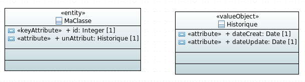

# Exemple de génération de ValueObject



L'association sera alors dans les deux sens:

MaClasse.java:

```java
package fr.gouv.diplomatie;

/*imports*/

@Entity
@Table(name = "ma_classe")
@NoArgsConstructor
@AllArgsConstructor
public class MaClasse  implements Serializable {
	
    /** The Constant serialVersionUID. */
    private static final long serialVersionUID = 1L;
    
    @Id@NotNull
    @Column(name = "id")
    public Integer id;
    
    @NotNull
    @Embedded
    @AttributeOverrides({
    	@AttributeOverride(name="dateCreat",column = @Column(name = "un_attribut_date_creat")),
    		@AttributeOverride(name="dateUpdate",column = @Column(name = "un_attribut_date_update"))
    })
    @AssociationOverrides({
    })
    public Historique unAttribut;
}
```

AutreClasse.java:

```java
package fr.gouv.diplomatie;

/*imports*/

@Embeddable
public class Historique  implements Serializable {
	
    /** The Constant serialVersionUID. */
    private static final long serialVersionUID = 1L;
    
    @NotNull
    @Column(name = "date_creat")
    public Date dateCreat;
    
    @NotNull
    @Column(name = "date_update")
    public Date dateUpdate;
}
```