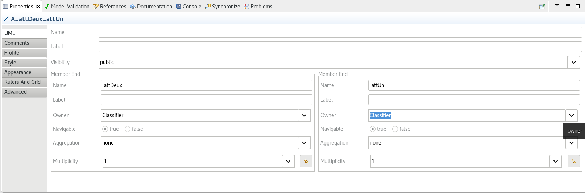
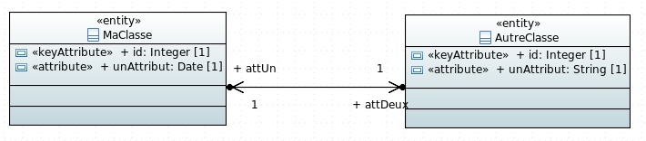
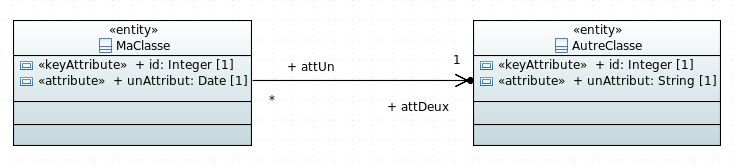
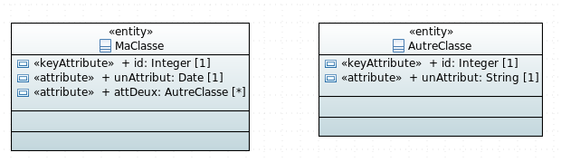

# Exemple de génération d'association

##

Les associations directionelles peuvent être dans un sens ou dans les deux sens.
Lorsqu'elles sont orientées dans un sens, seuls les champs de la classe de laquelle part l'association seront générés (`attention: sauf pour les associations many to many où tous les champs seront générés même si l'association n'est que dans un sens. Ne pas utiliser l'association dans les deux sens pour ce cas la.`)

Pour passer une association dans les deux sens il faut cliquer sur le lien d'association, allez dans le vue `Properties` et changer la propriété `Owner` du `Member End` pour la passer de `Association` a `Classifier`:



L'association sera alors dans les deux sens:



## One To One


Sera généré de la façon suivante :

MaClasse.java:

```java
package fr.gouv.diplomatie;

/*imports*/

@Entity
@Table(name = "ma_classe")
@NoArgsConstructor
@AllArgsConstructor
public class MaClasse  implements Serializable {
	
    /** The Constant serialVersionUID. */
    private static final long serialVersionUID = 1L;
    
    @Id@NotNull
    @Column(name = "id")
    public Integer id;
    
    @NotNull
    @Column(name = "un_attribut")
    public Date unAttribut;
    
    @NotNull
    @OneToOne(cascade = {CascadeType.REMOVE})
    @JoinColumn(name = "id_att_deux")
    public AutreClasse attDeux;
}
```

AutreClasse.java:

```java
package fr.gouv.diplomatie;

/*imports*/

@Entity
@Table(name = "autre_classe")
@NoArgsConstructor
@AllArgsConstructor
public class AutreClasse  implements Serializable {
	
    /** The Constant serialVersionUID. */
    private static final long serialVersionUID = 1L;
    
    @Id@NotNull
    @Column(name = "id")
    public Integer id;
    
    @NotNull
    @Column(name = "un_attribut")
    public String unAttribut;
    
    // code si dessous généré uniquement
    // si l'association est dans les deux sens
    @NotNull
    @OneToOne(cascade = {CascadeType.REMOVE})
    @JoinColumn(name = "id_att_un")
    public MaClasse attUn;
}
```


## One To Many


Sera généré de la façon suivante :

MaClasse.java:

```java
package fr.gouv.diplomatie;

/*imports*/

@Entity
@Table(name = "ma_classe")
@NoArgsConstructor
@AllArgsConstructor
public class MaClasse  implements Serializable {
	
    /** The Constant serialVersionUID. */
    private static final long serialVersionUID = 1L;
    
    @Id@NotNull
    @Column(name = "id")
    public Integer id;
    
    @NotNull
    @Column(name = "un_attribut")
    public Date unAttribut;
    
    @OneToMany
    @JoinTable(name="ma_classe_att_deux", joinColumns=@JoinColumn(name="id_ma_classe", referencedColumnName="id"),
    	inverseJoinColumns=@JoinColumn(name="id_att_deux", referencedColumnName="id", unique=true))
    public Set<AutreClasse> attDeux;
}

```

AutreClasse.java:

```java
package fr.gouv.diplomatie;

/*imports*/

@Entity
@Table(name = "autre_classe")
@NoArgsConstructor
@AllArgsConstructor
public class AutreClasse  implements Serializable {
	
    /** The Constant serialVersionUID. */
    private static final long serialVersionUID = 1L;
    
    @Id@NotNull
    @Column(name = "id")
    public Integer id;
    
    @NotNull
    @Column(name = "un_attribut")
    public String unAttribut;
    
    // code si dessous généré uniquement
    // si l'association est dans les deux sens
    @NotNull
    @ManyToOne
    @JoinColumn(name = "id_att_un")
    public MaClasse attUn;
}

```

## Many To One



Ou


Sera généré de la façon suivante :

MaClasse.java:

```java
package fr.gouv.diplomatie;

/*imports*/

@Entity
@Table(name = "ma_classe")
@NoArgsConstructor
@AllArgsConstructor
public class MaClasse  implements Serializable {
	
    /** The Constant serialVersionUID. */
    private static final long serialVersionUID = 1L;
    
    @Id@NotNull
    @Column(name = "id")
    public Integer id;
    
    @NotNull
    @Column(name = "un_attribut")
    public Date unAttribut;
    
    //fetchtype généré si non lié
    @NotNull
    @ManyToOne(fetch=FetchType.EAGER)
    @JoinColumn(name = "id_att_deux")
    public AutreClasse attDeux;
}
```

AutreClasse.java:

```java
package fr.gouv.diplomatie;

/*imports*/

@Entity
@Table(name = "autre_classe")
@NoArgsConstructor
@AllArgsConstructor
public class AutreClasse  implements Serializable {
	
    /** The Constant serialVersionUID. */
    private static final long serialVersionUID = 1L;
    
    @Id@NotNull
    @Column(name = "id")
    public Integer id;
    
    @NotNull
    @Column(name = "un_attribut")
    public String unAttribut;
    
    // code si dessous généré uniquement
    // si l'association est dans les deux sens et liée
    @OneToMany
    @JoinTable(name="autre_classe_att_un", joinColumns=@JoinColumn(name="id_autre_classe", referencedColumnName="id"),
    	inverseJoinColumns=@JoinColumn(name="id_att_un", referencedColumnName="id", unique=true))
    public Set<MaClasse> attUn;
}
```

## Many To Many


ou



Sera généré de la façon suivante :

MaClasse.java:

```java
package fr.gouv.diplomatie;

/*imports*/

@Entity
@Table(name = "ma_classe")
@NoArgsConstructor
@AllArgsConstructor
public class MaClasse  implements Serializable {
	
    /** The Constant serialVersionUID. */
    private static final long serialVersionUID = 1L;
    
    @Id@NotNull
    @Column(name = "id")
    public Integer id;
    
    @NotNull
    @Column(name = "un_attribut")
    public Date unAttribut;
    
    // fetchtype généré si non lié
    @ManyToMany(fetch=FetchType.EAGER)
    @JoinTable(name="ma_classe_att_deux", joinColumns=@JoinColumn(name="id_ma_classe", referencedColumnName="id"),
    	inverseJoinColumns=@JoinColumn(name="id_att_deux", referencedColumnName="id"))
    public Set<AutreClasse> attDeux;
}

```

AutreClasse.java:

```java
package fr.gouv.diplomatie;

/*imports*/

@Entity
@Table(name = "autre_classe")
@NoArgsConstructor
@AllArgsConstructor
public class AutreClasse  implements Serializable {
	
    /** The Constant serialVersionUID. */
    private static final long serialVersionUID = 1L;
    
    @Id@NotNull
    @Column(name = "id")
    public Integer id;
    
    @NotNull
    @Column(name = "un_attribut")
    public String unAttribut;
    
    // code si dessous généré uniquement
    // si l'association est dans les deux sens et liée
    @ManyToMany
    @JoinTable(name="autre_classe_att_un", joinColumns=@JoinColumn(name="id_autre_classe", referencedColumnName="id"),
    	inverseJoinColumns=@JoinColumn(name="id_att_un", referencedColumnName="id"))
    public Set<MaClasse> attUn;
}
```
