# Générateur de code Hornet avec Papyrus

## Création d'un nouveau projet de génération

### Le projet

Utilisez le template yeoman pour générer un nouveau projet Hornet JS Lite

### Le modèle

Click droit sur le projet -> New-> Papyrus Model

Cliquez sur next.

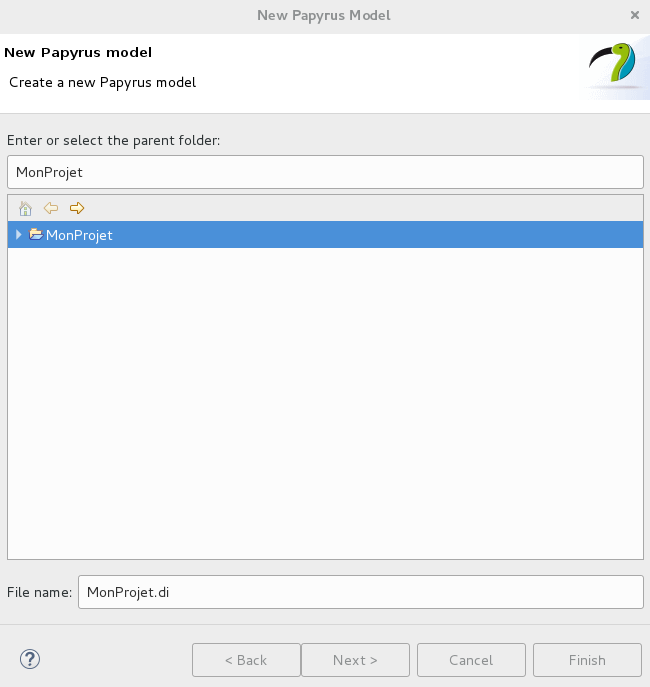

Choisissez le nom de votre modele puis cliquer sur next.

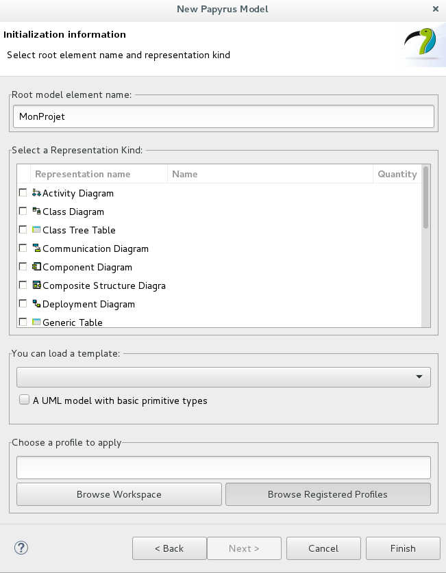

Choisissez le nom de votre element racine puis cliquez sur Browse Registered Profile.

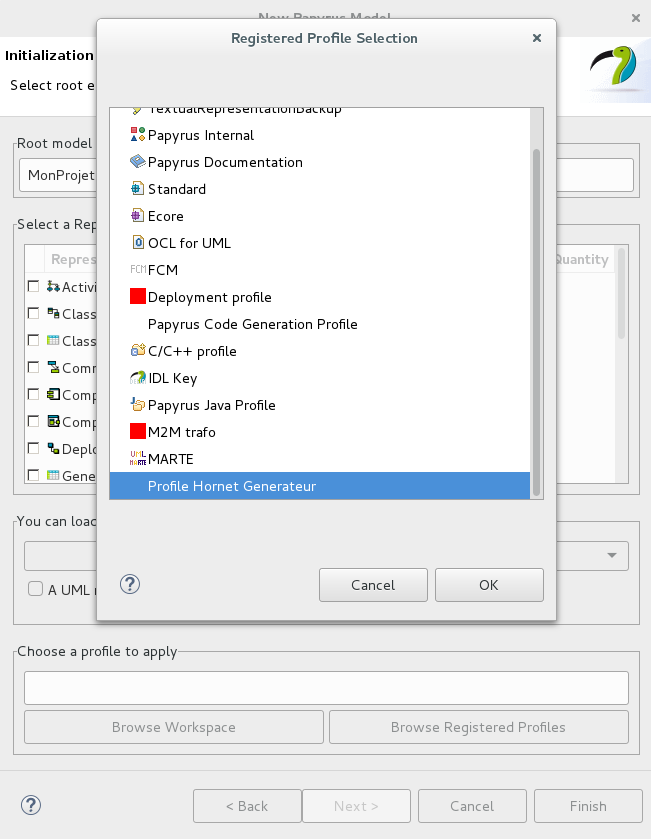

Choisissez le profile `Profile Hornet Generateur` puis cliquez sur OK.

`Attention cette étape n'est pas obligatoire`
Cochez le type `Class Diagram` si vous souhaitez avoir uniquement un seul diagramme de classe, sinon ne cochez pas cette case.

Cliquez sur Finish.

`Si vous avez coché la case Class Diagram passer les 4 étapes suivantes`.

`Si vous n'avez pas coché la case Class Diagram` vous arriverez sur la fenêtre suivante:

Cliquez sur le bouton `Create View` en bas au milieu de la fenêtre.

Choissez le profil que vous venez de créer.

Choisissez `Class Diagram` puis appuyer sur OK.

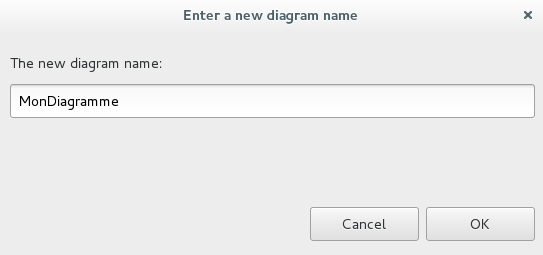

Entrez le nom de votre vue puis cliquer sur OK.

## Le diagramme de classe

### Les stéréotypes

`Attention`:  seuls les stéréotypes et attributs décrits ci dessous sont implémentés.
#### Les stéréotypes de classe

Les stéréotypes de classe proposés par le profil sont les suivants:

- entity: représente une entité majeure du métier qui regroupe des attributs.
- valueObject: représente une entité de second rang qui n'a d'existence dans le système que parce qu'elle est liée à une entité.
- nomenclature: définit un ensemble de couple code / libellé servant à caractériser des entités.

#### Les stéréotypes d'attributs

- attribute: attribut de la classe.
- keyAttribute: identifiant de la classe.
- sequence: sequence liée a un attributs. Elle ne seront appliquées que pour les attributs de type KeyAttribute.
- CodeLibelleNomenclature: couple code / libellé d'une nomenclature.

##### Les attributs du stéréotype attribute

| attibut   | description                                                        |
| --------- | ------------------------------------------------------------------ |
| length | Longueur du champ                                                     |

##### Les attributs du stéréotype sequence

| attibut   | description                                                        |
| --------- | ------------------------------------------------------------------ |
| startWith | Valeur de départ                                                   |
| incrementBy | Le pas de l'increment                                            |
| minValue | Valeur minimum                                                      |
| maxValue | Valeur maximum                                                      |
| cache | spécifie comment les numéros de séquence doivent être préalloués et stockés en mémoire pour un accès plus rapide, par défaut on préalloue 1 nombre.|                                   |
| cycle | si on atteint maxValue ou minValue, on autorise le générateur à boucler |                                   |
| hasMaxValue | Indique si le champs possède une valeur maximum                  |
| hasMinValue |  Indique si le champs possède une valeur minimum                 |

##### Les attributs du stéréotype CodeLibelleNomenclature

| attibut   | description                                                        |
| --------- | ------------------------------------------------------------------ |
| code | valeur                                                                  |
| libelle | libéllé lié a la valeur                                              |

### Attribution d'un stéréotype

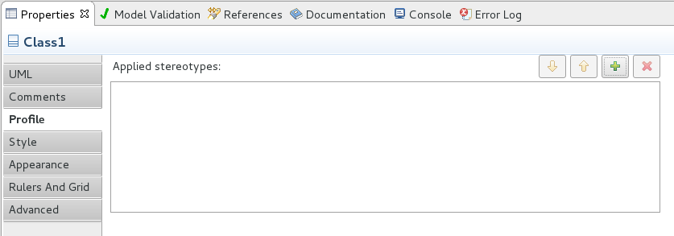

Après avoir sélectionné l'élément auquel il faut appliquer un profil, allez dans l'onglet `Profile` de la vue `Properties`.
Cliquez sur le plus en haut a droite pour ajouter un profil.

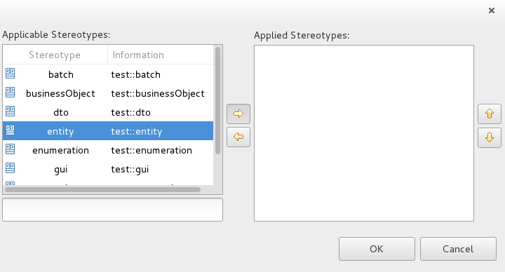

Selectionnez les profils à ajouter en double cliquant sur leurs nom ou en cliquant dessus puis en cliquant sur la flèche vers la droite.
Une fois les profils choisis cliquer sur OK.

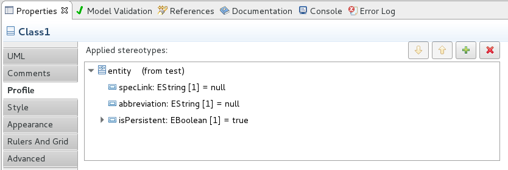

Les attributs des profils seront ensuites disponibles.
Pour changer la valeur d'un attribut, cliquez dessus.

Exemple d'une classe basique :

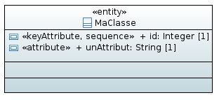

### Ajouter un commentaire

Les commentaires seront présents dans les classe métiers générées.

Poiur ajoutez un commentaire, allez dans l'onglet `comments` de la vue `Properties`.
Cliquez sur le plus en haut a droite du champs `Applied comments`.

Ecrivez votre commentaire puis cliquer sur OK.

### Les features gérées

#### Les interfaces

#### Les généralisations

`Attention`: pour les généralisations, les deux classes ne doivent pas avoir d'attributs ayant le même nom.

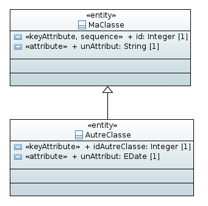

#### Les associations

Les tables peuvent être associées a d'autres tables.

Dans le cas suivants, un attributs nommé `autreclasse` sera présent dans `maClasse` il ets possible de renommé ce champs.

Toutes les multiplicités sont disponibles.

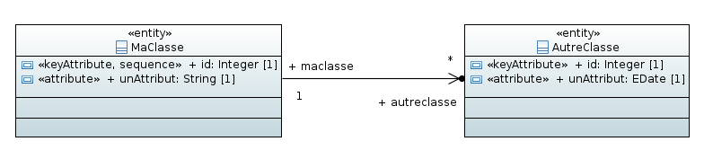

#### Les tables d'associations

Il est possible de créer des tables d'association entre deux classes ou plus.

Il faut au moins une entity reliée a la table d'association.

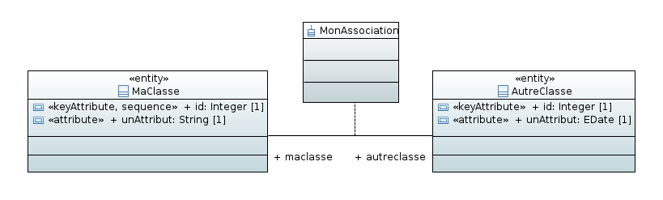

#### Les attributs
##### Les attributs primitifs

Les types primitifs gérés par le générateur sont les suivants:

- Boolean et EBoolean
- Integer
- EBigInteger
- Real
- EDouble
- EFloat
- EDate et Date
- EString et String
- EByteArray

Toutes les multiplicités sont disponibles.

##### Les attributs non primitifs

Il est possible d'avoir un attribut dont le type est une autres classe du modèle ( stéréotype entity, valueObject ou nomenclature).

Toutes les multiplicités sont disponibles.

## La génération de code

Une fois votre diagramme de classe terminé, faites un clic droit sur celui-ci -> Designer -> Generate Hornet Code

Le code sera générer dans un dossier src-gen dans votre projet.

La commande `Generate Hornet Code` permet de générer les fichiers suivants:

- le script de création de la base de donnée (src-gen/database)
- le modelDAO qui décrit les relations entre les entités de la base (src-gen/dao)
- les modeles des classes (src-gen/models/models)
- les interfaces d'attributs des classe (src-gen/models/attributs)
- les DTO des classes (src-gen/models/dto)
- les classes metier des classes (src-gen/models/metier)